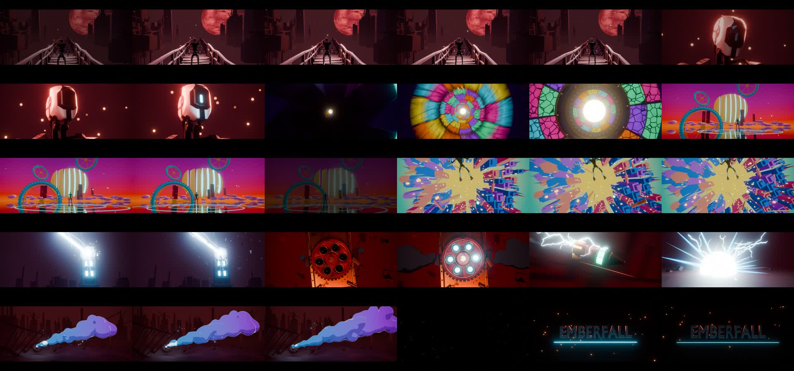

# EMBERFALL

A ~10-second, single continuous-shot animated short built from Python in Blender 4.5. Every set,
prop, plank, rivet, lightning bolt and smoke puff is generated by the scripts
in `shots/`. The one downloaded asset is the hero: the **Security Bot** from
Blender Studio's open movie *Charge* ([CC-BY 4.0](https://studio.blender.org/characters/security-bot/),
by the Blender Studio), animated by `shots/robot.py`.

It is a style study. It takes the shot rhythm, rendering language and
complexity of the first ten seconds of a painterly animated-series trailer
and tells an original micro-story with its own world, character and props.
Shots 2b–2d then break away into a bright, surreal vision sequence seen
through the robot's eye, set against the maroon world around it.



## The one-shot

The film plays as one unbroken camera move. Each segment ends with the
camera rushing into something that fills the frame and the next begins
inside the same thing, so every join is a matched transition rather than a
cut (`assemble_oneshot.py` holds the edit list, speed ramps and joins).

| Segment | What happens | Join into the next |
|---|---|---|
| **Reveal** (`seq_reveal.py reveal`) | Pitch black. Lightning silhouettes the robot, turned away, on a broken spire against the red moon. Black. A second flash: its head has whipped round to camera. The eye ignites. It crouches, launches straight at the lens on a third strike, and the camera falls with it. | push into the eye |
| **Iris Tunnel** (`shot_02b`) | Counter-rotating stained-glass and brass rings, accelerating toward a white-gold sun. | white-out |
| **Mirror Sea** (`shot_02c`) | It stands on an endless mirror under a moon sliced into drifting slabs; teal gear-rings overhead. | whip-tilt up |
| **Fall Upward** (`shot_02d`) | Spread-eagled, rising through a cobalt-and-coral city hanging from a lemon sky. | white-out back to reality |
| **Fire** (`seq_reveal.py fire`) | Still mid-fall in the storm, it whips its capacitor gauntlet up at the clocktower; the cells charge. | rush onto the gauntlet's six cells |
| **Load** (`shot_04`) | The same six cells, top-down: the drum ratchets and fires. | muzzle white-out |
| **The Round** (`shot_05`) | Riding the shell, lightning crawling its hull. | rush forward |
| **The Strike** (`shot_03`) | It punches into the clocktower; the clock face bursts. | dissolve |
| **Aftermath** (`shot_07`) | A cel-shaded plume rolls over the ruins. | fade to black |
| **Title** (`shot_08`) | EMBERFALL. | |

## The robot

`shots/robot.py` appends the Security Bot with its full rig (`./fetch_assets.sh`
downloads it into `assets/`, which git ignores), switches its paint-splatter
layers off, retints its eye to the film's teal and drives it through the
rig's own controls:

- keyed **action** on the rig's own controls: the head whip, crouch, leap,
  dive and gauntlet aim. Offsets are authored in world terms and converted
  into each control's rest space (`robot.world_offset`)
- a capacitor **gauntlet** bone-parented to the right forearm (`robot.gauntlet`)
- **poses** for the stills and the vision sequence (standing under the
  sliced moon, floating spread-eagled)
- the rig's **Eye Light** property is keyed for the close-up, where the eye
  stutters and then flares as it locks on

## How the look is built

- **Painterly surfaces** (`common.painted`): base colour broken into
  posterised "paint dab" bands by two layers of stretched noise, plus a
  worn-edge highlight taken from the angle between the Bevel-node normal
  and the true normal, so edges read as hand-brushed highlights.
- **Atmosphere without volumes** (`common.fog_group`): every surface mixes
  toward an emissive haze colour by camera distance and height, applied to
  camera rays only. It gives the layered maroon depth for a fraction of the
  cost of volumetrics.
- **2D-style FX in Cycles** (`common.toon`): Cycles has no Shader-to-RGB, so
  smoke and energy compute their own N·L, step it through a constant ramp
  into cel bands, and add a hard rim. The plume tints along world X
  (cyan → violet).
- **Cartoon smoke** (`common.smoke_puffs`): keyframed metaballs that are born,
  billow, drift with drag and turbulence and die. Ellipsoid lobes stretch
  along their flight for the impact burst.
- **Lightning** (`common.bolt`): midpoint-displacement poly curves with forked
  branches, regenerated every frame.
- **Grade** (`common.compositor`): anisotropic Kuwahara (brush strokes),
  bloom, lift/gamma/gain, chromatic dispersion and vignette. `assemble.sh`
  adds fades, the 2.39:1 letterbox and film grain.

## Rebuild it

Needs Blender 4.5 (`blender` on PATH) and ffmpeg.

```bash
./fetch_assets.sh                  # the Security Bot from Charge (~75 MB)
./render_all.sh final 0.6667 28 02b_tunnel 02c_mirror 02d_upward 03_strike 04_drum 05_round 07_plume 08_title
for m in reveal fire; do blender -b --factory-startup -P shots/seq_reveal.py -- $m --render --tag final --scale 0.6667 --samples 28; done
python3 assemble_oneshot.py final   # -> out/emberfall_oneshot_final.mp4

# one shot, one still, for look-dev
blender -b --factory-startup -P shots/shot_03_strike.py -- --still 10 --scale 0.5 --samples 24
```

Each shot script saves its scene to `render/blend/shotNN.blend`, so you can
open any shot in Blender and keep animating by hand.
